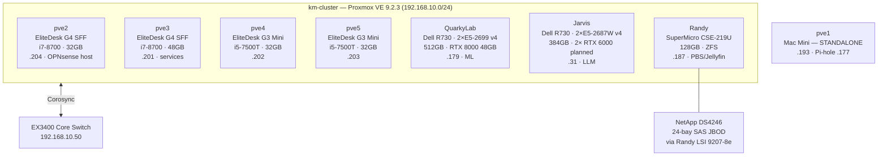

# 🔧 Proxmox Cluster
**Tags:** #infrastructure #proxmox #virtualization
**Related:** [[Infrastructure/Services & VMs]] · [[Compute/Dell R730 - ML Node]] · [[Infrastructure/Storage]] · [[Networking/Network Overview]]

---

## Cluster Overview



---

## km-cluster Node Table (7 nodes — PVE 9.2.3)

| Hostname | Hardware | CPU | RAM | IP | Role |
|---|---|---|---|---|---|
| pve2 | HP EliteDesk 800 G4 SFF | i7-8700 | 32GB | 192.168.10.204 | OPNsense VM 100 (live router), step-ca |
| pve3 | HP EliteDesk 800 G4 SFF | i7-8700 | 48GB | 192.168.10.201 | Primary services (NPM, Vaultwarden, Grafana, Homepage, Headscale, NUT) |
| pve4 | HP EliteDesk 800 G3 Mini | i5-7500T | 32GB | 192.168.10.202 | Cluster node |
| pve5 | HP EliteDesk 800 G3 Mini | i5-7500T | 32GB | 192.168.10.203 | Cluster node |
| QuarkyLab | Dell R730 (svc tag 1S8WR22) | 2× E5-2699 v4 | 512GB | 192.168.10.179 | ML node — RTX 8000 48GB (installed 2026-07-01) (Fernanda/DUNE); Wazuh VM 104. iDRAC .20 |
| Jarvis | Dell R730 | 2× E5-2687W v4 | 384GB | 192.168.10.31 | LLM node — no GPU yet; 2× RTX 6000 planned (SW stack staged 2026-07-01). iDRAC .21 |
| Randy | SuperMicro CSE-219U / X10DRU-i+ | 2× E5-2690 v4 | 128GB | 192.168.10.187 | PBS, Jellyfin, ZFS storage. IPMI .22 |

> **pve1** (Apple Mac Mini, 192.168.10.193) is a **standalone** Proxmox node — **not** in km-cluster. It hosts the Pi-hole LXC (192.168.10.177).

## Attached Storage

| Hardware | Notes |
|---|---|
| NetApp DS4246 | 24-bay SAS JBOD shelf (via Randy LSI 9207-8e, IT mode); passthrough pending |

---

## Headscale / Tailscale

| Device | Headscale IP |
|---|---|
| Ares | 100.64.0.1 |
| Randy | 100.64.0.2 |
| pve5 | 100.64.0.3 |
| pve4 | 100.64.0.4 |
| pve3 | 100.64.0.5 |
| Jarvis | 100.64.0.6 |

Headscale control plane: 192.168.10.186 (LXC 105). Remote PVE access: `https://100.116.237.31:8006` (pve1 Tailscale).

---

## Cluster Init Commands

```bash
# On first node — create cluster
pvecm create km-cluster

# On additional nodes — join cluster
pvecm add <first-node-ip>

# Verify cluster status
pvecm status
pvecm nodes
```

---

## Post-Install (all nodes)

```bash
# Remove enterprise repos (no subscription)
rm /etc/apt/sources.list.d/pve-enterprise.sources
rm /etc/apt/sources.list.d/ceph.sources
echo "deb http://download.proxmox.com/debian/pve trixie pve-no-subscription" \
  > /etc/apt/sources.list.d/pve-community.list
apt-get update

# Install Tailscale
curl -fsSL https://tailscale.com/install.sh | sh
tailscale up --advertise-routes=192.168.10.0/24
echo 'net.ipv4.ip_forward = 1' >> /etc/sysctl.conf && sysctl -p

# Fix Tailscale overwriting DNS (affects pve3–pve5)
tailscale set --accept-dns=false
# Then set node DNS in UI: System > DNS > 8.8.8.8, 1.1.1.1
```

---

## Storage Config (pve3)

Storage was present but not registered in cluster config. Added via Datacenter → Storage:

| Storage ID | Type | Path / Pool | Purpose |
|---|---|---|---|
| local | Directory | /var/lib/vz | CT templates, ISOs, backups |
| local-lvm | LVM-Thin | pve/data | Container and VM disks |

```bash
# CT template download (UI failed due to DNS issue)
pveam update
pveam download local debian-12-standard_12.12-1_amd64.tar.zst
```

---

## OPNsense VM (pve2 — live LAN router)

- **VM ID:** 100 on pve2, v25.7, onboot=1
- **Live** LAN router/firewall/DHCP for 192.168.10.0/24 (gateway 192.168.10.1). The UniFi Dream Router is now WAN-only upstream.
- Serial console access: `qm terminal 100` from pve2
- Wildcard cert: `*.kylemason.org` via Let's Encrypt DNS-01 (Cloudflare)
- ⚠️ Ares WiFi is on the WAN side (192.168.1.x) — keep a wired cable (enp0s31f6, .100) plugged in during any pve2/OPNsense maintenance.

Pre-cutover VLANs to configure:

| VLAN | Purpose |
|------|---------|
| 10 | Trusted (PCs, phones) |
| 20 | IoT (smart home, tablets) |
| 30 | Servers/Lab (Proxmox nodes) |
| 40 | Guest Wi-Fi |

---

## GPU Passthrough (future — quarkylab)

```bash
# /etc/default/grub
GRUB_CMDLINE_LINUX_DEFAULT="quiet intel_iommu=on iommu=pt"

# /etc/modules
vfio
vfio_iommu_type1
vfio_pci
vfio_virqfd

# Find GPU PCI address
lspci -nn | grep -i nvidia
# /etc/modprobe.d/vfio.conf
options vfio-pci ids=<vendor:device>

update-initramfs -u && reboot
```

---

See [[Infrastructure/Services & VMs]] for deployed containers.
See [[Runbook/Recovery Procedures]] for restore process.
