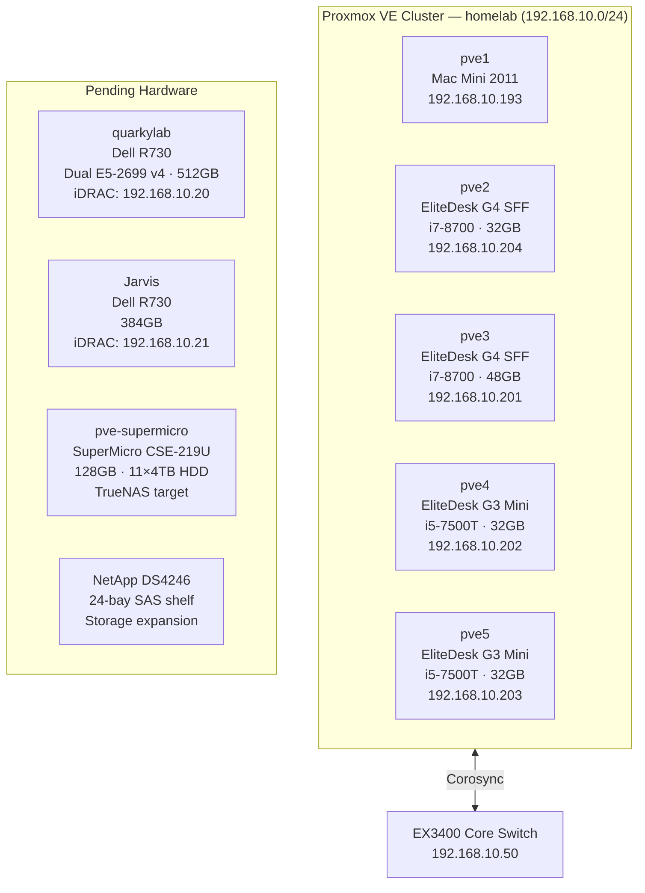

# 🔧 Proxmox Cluster
**Tags:** #infrastructure #proxmox #virtualization
**Related:** [[Infrastructure/Services & VMs]] · [[Compute/Dell R730 - ML Node]] · [[Infrastructure/Storage]] · [[Networking/Network Overview]]

---

## Cluster Overview



---

## Active Cluster Node Table

| Hostname | Hardware | CPU | RAM | IP | Role |
|---|---|---|---|---|---|
| pve1 | Apple Mac Mini (2011) | Core i5 | — | 192.168.10.193 | Cluster management, Pi-hole LXC |
| pve2 | HP EliteDesk 800 G4 SFF | i7-8700 | 32GB | 192.168.10.204 | Services; OPNsense VM 100 (pending cutover) |
| pve3 | HP EliteDesk 800 G4 SFF | i7-8700 | 48GB | 192.168.10.201 | Primary services node (NPM, Vaultwarden, Grafana) |
| pve4 | HP EliteDesk 800 G3 Mini | i5-7500T | 32GB | 192.168.10.202 | Services |
| pve5 | HP EliteDesk 800 G3 Mini | i5-7500T | 32GB | 192.168.10.203 | Services |

## Pending Hardware

| Hostname | Hardware | CPU | RAM | iDRAC / Notes |
|---|---|---|---|---|
| quarkylab | Dell R730 (svc tag: 1S8WR22) | Dual E5-2699 v4 | 512GB (target) | iDRAC: 192.168.10.20 — BIOS update in progress |
| Jarvis | Dell R730 | Dual E5 | 384GB | iDRAC: 192.168.10.21 — iDRAC confirmed SSH |
| pve-supermicro | SuperMicro CSE-219U | 24c/48t | 128GB | 11× 4TB HDD — TrueNAS target |
| — | NetApp DS4246 | — | — | 24-bay SAS shelf, storage expansion |

---

## Tailscale

| Device | Tailscale IP |
|---|---|
| pve1 (Mac Mini) | 100.116.237.31 |
| Ares (Dell laptop) | 100.124.118.63 |

Remote access: `https://100.116.237.31:8006`

---

## Cluster Init Commands

```bash
# On first node — create cluster
pvecm create homelab

# On additional nodes — join cluster
pvecm add <first-node-ip>

# Verify cluster status
pvecm status
pvecm nodes
```

---

## Post-Install (all nodes)

```bash
# Remove enterprise repos (no subscription)
rm /etc/apt/sources.list.d/pve-enterprise.sources
rm /etc/apt/sources.list.d/ceph.sources
echo "deb http://download.proxmox.com/debian/pve trixie pve-no-subscription" \
  > /etc/apt/sources.list.d/pve-community.list
apt-get update

# Install Tailscale
curl -fsSL https://tailscale.com/install.sh | sh
tailscale up --advertise-routes=192.168.10.0/24
echo 'net.ipv4.ip_forward = 1' >> /etc/sysctl.conf && sysctl -p

# Fix Tailscale overwriting DNS (affects pve3–pve5)
tailscale set --accept-dns=false
# Then set node DNS in UI: System > DNS > 8.8.8.8, 1.1.1.1
```

---

## Storage Config (pve3)

Storage was present but not registered in cluster config. Added via Datacenter → Storage:

| Storage ID | Type | Path / Pool | Purpose |
|---|---|---|---|
| local | Directory | /var/lib/vz | CT templates, ISOs, backups |
| local-lvm | LVM-Thin | pve/data | Container and VM disks |

```bash
# CT template download (UI failed due to DNS issue)
pveam update
pveam download local debian-12-standard_12.12-1_amd64.tar.zst
```

---

## OPNsense VM (pve2 — pending cutover)

- **VM ID:** 100 on pve2
- Not yet in network path — Dream Router still routing
- Serial console access: `qm terminal 100` from pve2
- If VM config read-only: `chmod 640 /etc/pve/nodes/pve2/qemu-server/100.conf`
- Wildcard cert issued: `*.kylemason.org` via Let's Encrypt DNS-01 (Cloudflare)
- Cutover plan: hardwire rack → swap cables → ~2 min downtime

Pre-cutover VLANs to configure:

| VLAN | Purpose |
|------|---------|
| 10 | Trusted (PCs, phones) |
| 20 | IoT (smart home, tablets) |
| 30 | Servers/Lab (Proxmox nodes) |
| 40 | Guest Wi-Fi |

---

## GPU Passthrough (future — quarkylab)

```bash
# /etc/default/grub
GRUB_CMDLINE_LINUX_DEFAULT="quiet intel_iommu=on iommu=pt"

# /etc/modules
vfio
vfio_iommu_type1
vfio_pci
vfio_virqfd

# Find GPU PCI address
lspci -nn | grep -i nvidia
# /etc/modprobe.d/vfio.conf
options vfio-pci ids=<vendor:device>

update-initramfs -u && reboot
```

---

See [[Infrastructure/Services & VMs]] for deployed containers.
See [[Runbook/Recovery Procedures]] for restore process.
