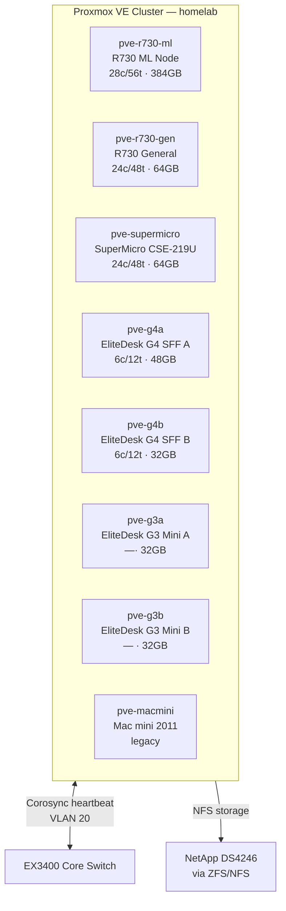

# 🔧 Proxmox Cluster
**Tags:** #infrastructure #proxmox #virtualization  
**Related:** [[Infrastructure/Services & VMs]] · [[Compute/Dell R730 - ML Node]] · [[Infrastructure/Storage]] · [[Networking/Network Overview]]

---

## Cluster Overview



---

## Cluster Node Table

| Hostname | Role | CPU | RAM | Priority |
|---|---|---|---|---|
| pve-r730-ml | ML/CUDA primary | 28c/56t | 384 GB | P1 — Fernanda's workloads |
| pve-r730-gen | General VM host | 24c/48t | 64 GB | P1 — Core services |
| pve-supermicro | Mixed / storage-adjacent | 24c/48t | 64 GB | P2 |
| pve-g4a | Small node | 6c/12t | 48 GB | P3 |
| pve-g4b | Small node | 6c/12t | 32 GB | P3 |
| pve-g3a | Small node | — | 32 GB | P3 |
| pve-g3b | Small node | — | 32 GB | P3 |
| pve-macmini | Experimental only | — | — | P4 — legacy |

---

## Cluster Init Commands

```bash
# On first node — create cluster
pvecm create homelab

# On additional nodes — join cluster
pvecm add <first-node-ip>

# Verify cluster status
pvecm status
pvecm nodes
```

---

## Storage Config (Proxmox side)

```bash
# Add NFS share from ZFS host
# In Proxmox UI: Datacenter > Storage > Add > NFS
# Or via CLI:
pvesm add nfs nfs-datastore \
  --server 10.0.30.10 \
  --export /datastore/vms \
  --content images,rootdir \
  --nodes all
```

---

## VM Layout (Planned)

| VM / CT | Host | vCPU | RAM | VLAN | Purpose |
|---|---|---|---|---|---|
| OPNsense | pve-r730-gen | 2 | 4 GB | Trunk | Router/firewall |
| Vaultwarden | pve-r730-gen | 2 | 2 GB | SERVICES (40) | Password manager |
| Jellyfin | pve-r730-gen | 4 | 8 GB | SERVICES (40) | Media server |
| Uptime Kuma | pve-g4a | 1 | 1 GB | SERVICES (40) | Monitoring |
| Grafana + Loki | pve-g4a | 2 | 4 GB | SERVICES (40) | Metrics/logging |
| Home Assistant | pve-macmini / RPi | 2 | 2 GB | IOT (50) | Smart home |
| FreePBX | pve-r730-gen | 2 | 4 GB | VOIP (60) | VoIP PBX |
| Fernanda ML VM | pve-r730-ml | 20 | 320 GB | COMPUTE (20) | CUDA/PyTorch |
| UniFi Controller | pve-g4b | 2 | 4 GB | MGMT (10) | Network controller |
| PBS | pve-supermicro | 4 | 8 GB | MGMT (10) | Proxmox Backup Server |

---

## OPNsense — Router-on-a-Stick Setup

```bash
# OPNsense VM — network interfaces
# vtnet0 = WAN (untagged or tagged from ISP)
# vtnet1 = LAN trunk (all VLANs)

# In OPNsense, create VLAN subinterfaces on vtnet1:
# Interfaces > Other Types > VLAN
# VLAN tag: 10, 20, 30, 40, 50, 60, 70, 99
# Assign each as a separate OPNsense interface
# Enable DHCP server per VLAN
# Apply firewall rules per interface
```

---

## GPU Passthrough (R730 ML Node)

```bash
# /etc/default/grub
GRUB_CMDLINE_LINUX_DEFAULT="quiet intel_iommu=on iommu=pt"

# /etc/modules
vfio
vfio_iommu_type1
vfio_pci
vfio_virqfd

# /etc/modprobe.d/blacklist.conf
blacklist nouveau
blacklist nvidia

# Find GPU PCI address
lspci -nn | grep -i nvidia
# Example: 03:00.0 VGA [10de:1e04]

# /etc/modprobe.d/vfio.conf
options vfio-pci ids=10de:1e04,10de:10f7

# VM config (add to /etc/pve/qemu-server/<vmid>.conf)
hostpci0: 03:00,pcie=1,x-vga=1

update-initramfs -u
reboot
```

---

## Proxmox Backup Server (PBS)

- Runs on SuperMicro node
- Backs up all VMs on a schedule
- Stores backups to DS4246 NFS share (`datastore/backups`)
- Retention: 7 daily, 4 weekly, 3 monthly

See [[Runbook/Recovery Procedures]] for restore process.
