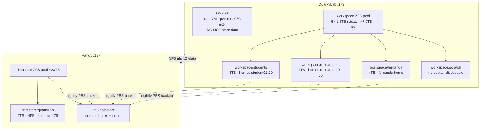

# 💽 QuarkyLab Storage & Backup
**Tags:** #infrastructure #storage #zfs #pbs #backup #quarkylab #ml
**Related:** [[Infrastructure/Storage]] · [[Compute/Dell R730 - ML Node]] · [[Infrastructure/Proxmox Cluster]] · [[Runbook/randy-commissioning-runbook]] · [[00 - Homelab MOC]]

---

## Overview

Storage for **QuarkyLab** (`.179`, ML node / Fernanda's DUNE agent + the multi-tenant student SLURM environment) is split into three tiers by purpose: fast local working sets, bulk persistent data on Randy over NFS, and backups to Randy's PBS. Set up during the 2026-07-02 maintenance window.



> [!NOTE] Backup boundary
> `workspace/scratch` is **disposable and NOT backed up**. Everything a user wants kept must live in their home (`workspace/students|researchers|fernanda`), which is backed up nightly to PBS.

---

## Tier 1 — Local working sets (`workspace` ZFS pool)

Local pool on 5× 1.8 TB HDDs in **raidz1** (single-disk fault tolerance), lz4 compression, mounted at `/workspace`. `sdc` (931 GB) is a free spare, not pooled.

| Dataset | Mountpoint | Quota | Per-user quota | Use |
|---|---|---|---|---|
| `workspace/students` | `/workspace/students` | 3 TB | 100 GB | student01–20 homes |
| `workspace/researchers` | `/workspace/researchers` | 1 TB | 150 GB | researcher01–06 homes |
| `workspace/fernanda` | `/workspace/fernanda` | 4 TB | — | Fernanda's home + data |
| `workspace/scratch` | `/workspace/scratch` | none | — | disposable per-user scratch |

**Homes live on the pool (model A):** `usermod -d` repointed every student/researcher/fernanda home off the cramped OS disk onto these datasets (2026-07-02). `/home` now holds only admin accounts (kyle, machismo). Student jobs bind `$HOME` + `/workspace/scratch/$USER:/scratch` (see [[Compute/Dell R730 - ML Node]] / job_submit.lua).

```bash
zpool status workspace                     # raidz1 health
zfs list -o name,used,avail,quota,mountpoint workspace
zfs userspace workspace/students           # per-user usage vs 100G quota
```

---

## Tier 2 — Bulk persistent (`/data`, NFS from Randy)

Randy exports the ZFS dataset `datastore/quarkylab` (2 TB quota, lz4) to QuarkyLab **only**; QuarkyLab mounts it at `/data`.

| Field | Value |
|---|---|
| Export (on Randy) | `/datastore/quarkylab 192.168.10.179(rw,sync,no_subtree_check,no_root_squash)` |
| Mount (on QuarkyLab) | `192.168.10.187:/datastore/quarkylab → /data` (nfs4.2, `_netdev` in fstab) |
| Holds | `/data/containers/base.sif` (student ML image), `/data/shared` (read-only bind into jobs) |

> [!WARNING] Only `datastore/quarkylab` is exported
> An earlier misconfiguration exported the whole PBS repo to QuarkyLab; that was remediated so `.179` can reach only its own `datastore/quarkylab` dataset. Do not re-export a parent path.

---

## Tier 3 — Backup (Randy PBS)

Randy (`.187`) runs **Proxmox Backup Server** (`:8007`, datastore `datastore` at `/datastore`, ~23 TB). The same ZFS pool does double duty: raw NFS shares (Tier 2) **and** PBS dedup chunk storage.

### Workspace backup (QuarkyLab → PBS)

Script `/usr/local/sbin/pbs-workspace-backup.sh` (700) backs up the three real datasets as separate archives under backup-id `quarkylab-workspace`. `scratch` is excluded by omission; separate archives also avoid ZFS child-dataset mount boundaries.

```bash
# reuses cred /etc/pve/priv/storage/randy-pbs.pw + fingerprint from storage.cfg
export PBS_REPOSITORY="root@pam@192.168.10.187:datastore"
proxmox-backup-client backup \
    students.pxar:/workspace/students \
    researchers.pxar:/workspace/researchers \
    fernanda.pxar:/workspace/fernanda \
    --backup-id quarkylab-workspace --backup-type host
proxmox-backup-client prune host/quarkylab-workspace --keep-daily 7 --keep-weekly 4
```

| Job | Where | Schedule | Notes |
|---|---|---|---|
| Workspace backup | QuarkyLab `pbs-workspace-backup.timer` | nightly **01:30** | systemd timer, `Persistent=true` |
| Prune | (in backup script) | each run | keep-daily 7 + keep-weekly 4 |
| Garbage collection | Randy datastore `gc-schedule` | daily **03:00** | reclaims unreferenced chunks (24h+ grace) |
| Verify | Randy `verify-datastore` job | weekly **Sun 04:00** | `ignore-verified`, re-verify >30 days |

> [!NOTE] Dedup is content-addressed
> Re-running the backup with unchanged data uploads **0 bytes** (100% chunk reuse) — only genuinely changed data transfers. Because same-day snapshots are byte-identical, GC after a same-day prune frees ~0 (chunks still referenced by the surviving snapshot); real reclamation happens as older daily/weekly snapshots age out.

Since homes moved off `/home`, the **host-level** `host/quarkylab` backup's `home.pxar` is now near-empty — `host/quarkylab-workspace` is the authoritative home/user-data backup.

### Restore

```bash
export PBS_REPOSITORY="root@pam@192.168.10.187:datastore"
proxmox-backup-client snapshot list host/quarkylab-workspace
# restore one dataset from a snapshot to a target dir
proxmox-backup-client restore host/quarkylab-workspace/<snapshot> students.pxar /restore/students
```

---

## Quick reference

| What | Where |
|---|---|
| Student/researcher/fernanda homes | `/workspace/{students,researchers,fernanda}/…` |
| Disposable scratch (in-job `/scratch`) | `/workspace/scratch/$USER` |
| Student ML container + shared data | `/data/containers/base.sif`, `/data/shared` (Randy NFS) |
| Nightly home backup | PBS `host/quarkylab-workspace` on Randy |
| Backup script / timer | `/usr/local/sbin/pbs-workspace-backup.sh`, `pbs-workspace-backup.timer` |

---

## Related
- [[Infrastructure/Storage]] — physical JBOD / NetApp DS4246
- [[Compute/Dell R730 - ML Node]] — QuarkyLab node, GPU, student SLURM env
- [[Infrastructure/Proxmox Cluster]] — cluster storage overview
- [[Runbook/randy-commissioning-runbook]] — Randy (PBS/storage) build
