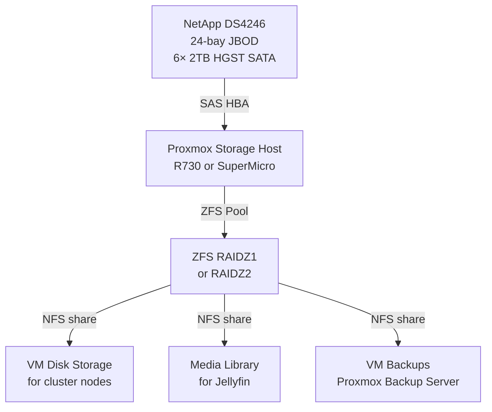

# 💾 Storage
**Tags:** #infrastructure #storage #netapp #jbod  
**Related:** [[Rack Layout]] · [[Infrastructure/Proxmox Cluster]] · [[Infrastructure/Services & VMs]]

---

## NetApp DS4246 — JBOD Shelf

| Field | Value |
|---|---|
| Model | NetApp DS4246 |
| Form Factor | 4U |
| Rack Position | U8–U12 |
| Bay Count | 24 bays |
| Interface | SAS (dual IOM6 modules) |
| Currently Populated | 6× HGST 2TB SATA |
| Total Raw (current) | 12 TB |
| Max Capacity | 24× drives |
| Weight (populated) | ~45 lbs — mount before drives above |

---

## Current Drive Inventory

| Bay | Drive | Capacity | Type | Status |
|---|---|---|---|---|
| 1 | HGST HUS726020ALS210 | 2 TB | SATA 7.2K | Active |
| 2 | HGST HUS726020ALS210 | 2 TB | SATA 7.2K | Active |
| 3 | HGST HUS726020ALS210 | 2 TB | SATA 7.2K | Active |
| 4 | HGST HUS726020ALS210 | 2 TB | SATA 7.2K | Active |
| 5 | HGST HUS726020ALS210 | 2 TB | SATA 7.2K | Active |
| 6 | HGST HUS726020ALS210 | 2 TB | SATA 7.2K | Active |
| 7–24 | *Empty* | — | — | Unpopulated |

---

## Storage Architecture (Planned)



---

## ZFS Pool Planning

| Config | Raw | Usable | Fault Tolerance |
|---|---|---|---|
| RAIDZ1 (6× 2TB) | 12 TB | ~10 TB | 1 drive failure |
| RAIDZ2 (6× 2TB) | 12 TB | ~8 TB | 2 drive failures |
| Mirror (3× 2-way) | 12 TB | ~6 TB | 1 per mirror group |

**Recommendation:** RAIDZ1 for media (tolerable loss) → RAIDZ2 if drives expand.

```bash
# Create RAIDZ1 pool
zpool create datastore raidz /dev/sda /dev/sdb /dev/sdc /dev/sdd /dev/sde /dev/sdf

# Enable compression
zfs set compression=lz4 datastore

# Create datasets
zfs create datastore/vms
zfs create datastore/media
zfs create datastore/backups

# NFS share
zfs set sharenfs="rw=@10.0.30.0/24,no_root_squash" datastore/vms
```

---

## SAS HBA Notes

- DS4246 connects via SAS to a host HBA card
- R730s and SuperMicro have PCIe slots — verify HBA compatibility (LSI 9300-8e or equivalent)
- Run HBA in **IT mode** (passthrough) — not IR mode — for ZFS direct disk access

---

## Future Expansion

- DS4246 has 18 empty bays — room to grow
- HGST Ultrastar drives are enterprise-grade, compatible with ZFS
- Monitor drive health via `zpool status` and Grafana/SMART dashboard
