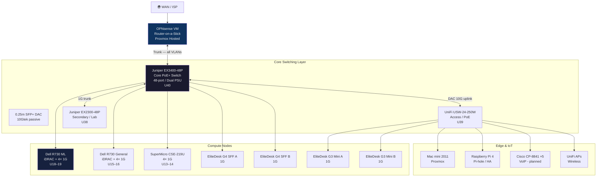
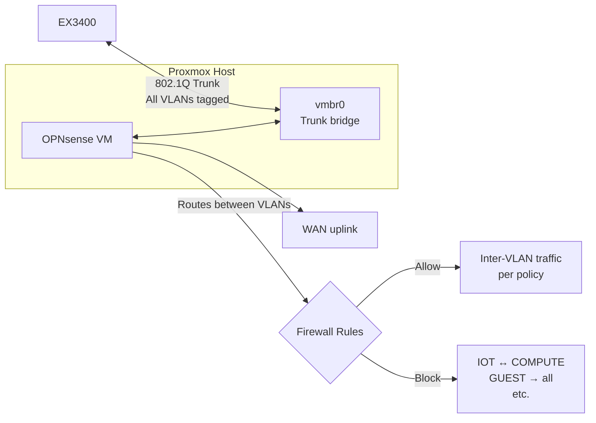

# 🌐 Network Overview
**Tags:** #networking #topology #vlans  
**Related:** [[Networking/Juniper EX3400-48P]] · [[Networking/UniFi USW-24-250W]] · [[Networking/Juniper EX2300-48P]] · [[Rack Layout]] · [[00 - Homelab MOC]]

---

## Physical Topology

---

## VLAN Plan

| VLAN ID | Name | Subnet | Purpose |
|---|---|---|---|
| 1 | Native/Default | — | Untagged (avoid in prod) |
| 10 | MGMT | 10.0.10.0/24 | iDRAC, switch OOB, UPS |
| 20 | COMPUTE | 10.0.20.0/24 | Proxmox hosts, VMs |
| 30 | STORAGE | 10.0.30.0/24 | NFS/iSCSI traffic isolation |
| 40 | SERVICES | 10.0.40.0/24 | Jellyfin, Vaultwarden, Uptime Kuma |
| 50 | IOT | 10.0.50.0/24 | Home Assistant, Frigate, IMUs |
| 60 | VOIP | 10.0.60.0/24 | CP-8841 phones, FreePBX |
| 70 | LAB | 10.0.70.0/24 | Experimental / CCNA lab |
| 99 | GUEST | 10.0.99.0/24 | Isolated guest WiFi |

> [!NOTE] Router-on-a-Stick
> OPNsense VM handles inter-VLAN routing via a single trunk link to EX3400. Each VLAN is a subinterface on the OPNsense uplink. See [[Networking/Juniper EX3400-48P]] for trunk config.

---

## Routing Architecture

---

## DNS & DHCP

| Service | Host | VLAN |
|---|---|---|
| Pi-hole (primary DNS) | RPi 4 | 50 (IoT) / serves all |
| OPNsense DHCP | OPNsense VM | Per-VLAN |
| Local domain | `homelab.local` | All |

---

## Switching — Quick Reference

| Device | See Note | Role |
|---|---|---|
| Juniper EX3400-48P | [[Networking/Juniper EX3400-48P]] | Core, PoE+, dual PSU, 10G |
| UniFi USW-24-250W | [[Networking/UniFi USW-24-250W]] | Access, PoE+, UniFi managed |
| Juniper EX2300-48P | [[Networking/Juniper EX2300-48P]] | Secondary / lab isolation |

---

## DAC Interconnect

| Link | Cable | Speed |
|---|---|---|
| EX3400 ↔ USW-24 | 10Gtek 0.25m passive SFP+ DAC | 10 Gbps |
| EX3400 ↔ EX2300 | 1G copper (temp) → upgrade to DAC | 1 Gbps |

---

## Addresses — Static Assignments (MGMT VLAN 10)

| Device | IP | Notes |
|---|---|---|
| OPNsense | 10.0.10.1 | Gateway |
| EX3400-48P | 10.0.10.2 | |
| USW-24-250W | 10.0.10.3 | |
| EX2300-48P | 10.0.10.4 | |
| R730 ML iDRAC | 10.0.10.10 | |
| R730 Gen iDRAC | 10.0.10.11 | |
| SuperMicro IPMI | 10.0.10.12 | |
| RPi 4 | 10.0.10.20 | |
| Mac mini | 10.0.10.21 | |
