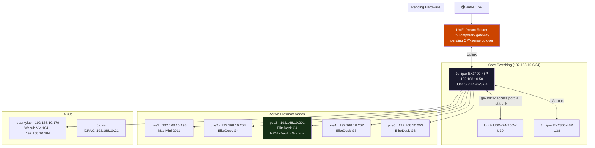

# 🌐 Network Overview
**Tags:** #networking #topology #vlans
**Related:** [[Networking/Juniper EX3400-48P]] · [[Networking/UniFi USW-24-250W]] · [[Networking/Juniper EX2300-48P]] · [[Rack Layout]] · [[00 - Homelab MOC]]

---

> [!NOTE] Current vs Planned State
> The network is currently a **flat 192.168.10.0/24** subnet — VLANs are planned but not yet implemented. OPNsense (VM 100 on pve2) is configured with wildcard SSL and Tailscale but **not yet in the routing path** — the UniFi Dream Router is still the gateway. The 10.0.x.x VLAN subnets below are the post-cutover target state.

---

## Current Physical Topology



---

## ⚠️ Known Network Issues

| Issue | Status |
|---|---|
| ge-0/0/32 uplink to UniFi is **access port** (not trunk) — VLANs not passing | Open |
| WiFi → EX3400 path **broken** — Ares on WiFi cannot reach EX3400 or cluster nodes | Open |
| DAC uplink xe-0/2/3 → UniFi SFP 2 **down** — speed mismatch (EX3400 reads 10G, UniFi reads 1G) | Open |
| OPNsense **not in routing path** — Dream Router still active | Open |

**Workaround for Ares → EX3400 access (wired only):**
```bash
sudo ip addr add 192.168.10.100/24 dev enp0s31f6
sudo ip link set enp0s31f6 up
ssh mason@192.168.10.50   # EX3400
```

---

## Current Static IP Assignments

| Device | IP | Notes |
|--------|-----|-------|
| pve1 (Mac Mini) | 192.168.10.193 | Tailscale: 100.116.237.31 |
| pve2 | 192.168.10.204 | Hosts OPNsense VM 100 |
| pve3 | 192.168.10.201 | Hosts NPM, Vaultwarden, Grafana |
| pve4 | 192.168.10.202 | |
| pve5 | 192.168.10.203 | |
| Ares (laptop wired) | 192.168.10.100 | Static via `ip addr add` |
| Juniper EX3400 | 192.168.10.50 | Renumbered 2026-06-05 |
| quarkylab | 192.168.10.179 | R730 Proxmox host (node 5) |
| quarkylab iDRAC | 192.168.10.20 | R730 svc tag 1S8WR22 |
| Wazuh VM (quarkylab) | 192.168.10.184 | VM 104 |
| Jarvis iDRAC | 192.168.10.21 | MAC: 18:66:da:97:0f:8e |
| Nginx Proxy Manager | 192.168.10.181 | CT 101 on pve3 |
| Vaultwarden | 192.168.10.182 | CT 102 on pve3 |
| Grafana | 192.168.10.183 | CT 103 on pve3 |
| Pi-hole primary | 192.168.1.47 | pve1 LXC |
| Pi-hole backup | 192.168.1.170 | Raspberry Pi 4 |

---

## Post-Cutover VLAN Plan

> These VLANs will be live after OPNsense cutover. Currently unimplemented.

| VLAN ID | Name | Subnet | Purpose |
|---|---|---|---|
| 1 | Native/Default | — | Untagged (avoid in prod) |
| 10 | MGMT | 10.0.10.0/24 | iDRAC, switch OOB, UPS |
| 20 | COMPUTE | 10.0.20.0/24 | Proxmox hosts, VMs |
| 30 | STORAGE | 10.0.30.0/24 | NFS/iSCSI traffic isolation |
| 40 | SERVICES | 10.0.40.0/24 | NPM, Vaultwarden, Grafana |
| 50 | IOT | 10.0.50.0/24 | Home Assistant, Frigate, IMUs |
| 60 | VOIP | 10.0.60.0/24 | CP-8841 phones, FreePBX |
| 70 | LAB | 10.0.70.0/24 | Experimental / CCNA lab |
| 99 | GUEST | 10.0.99.0/24 | Isolated guest WiFi |

---

## OPNsense Cutover Plan

Current routing: Dream Router → EX3400 access port

Post-cutover routing: OPNsense VM 100 (pve2) → EX3400 trunk → all VLANs

```
Pre-cutover checklist:
1. Fix ge-0/0/32 to trunk mode (remove native-vlan-id workaround)
2. Configure VLANs in OPNsense (vtnet1 subinterfaces)
3. Configure DHCP per VLAN in OPNsense
4. Set firewall rules
5. Test from console (not over network!)
6. Cutover: patch OPNsense uplink cable, verify routing, remove Dream Router
~2 min downtime during swap
```

> Emergency access during cutover: `qm terminal 100` from pve2 shell

---

## Switching — Quick Reference

| Device | IP | Role |
|--------|-----|------|
| Juniper EX3400-48P | 192.168.10.50 | Core, PoE+, dual PSU, 10G |
| UniFi USW-24-250W | — | Access, PoE+ |
| Juniper EX2300-48P | — | Secondary / lab isolation |

---

## DNS

| Service | IP | Notes |
|---------|-----|-------|
| Pi-hole primary | 192.168.1.47 | pve1 LXC |
| Pi-hole backup | 192.168.1.170 | Raspberry Pi 4 |
| Tailscale DNS | 100.100.100.100 | — set `--accept-dns=false` on nodes |
