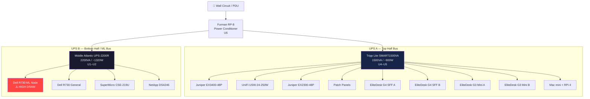

# ⚡ Power Distribution
**Tags:** #infrastructure #power #ups  
**Related:** [[Rack Layout]] · [[Compute/Dell R730 - ML Node]] · [[00 - Homelab MOC]]

---

## UPS Strategy — Split Bus Architecture

Two independent UPS units cover separate load zones, protecting different tiers of equipment based on criticality and power draw.

---

## UPS Specs

### Tripp Lite SMART1500VA (UPS A — Top Half)
| Field | Value |
|---|---|
| Model | SMART1500LCD |
| Capacity | 1500VA / 900W |
| Rack Position | U4–U5 (2U) |
| Form Factor | 2U rackmount |
| Runtime (half load) | ~15–20 min est. |
| Bus Assignment | Networking + Small compute |
| Output | 8 outlets (battery + surge) |

### Middle Atlantic UPS-2200R (UPS B — Bottom / ML Bus)
| Field | Value |
|---|---|
| Model | UPS-2200R |
| Capacity | 2200VA / 1320W |
| Rack Position | U1–U2 (2U) |
| Form Factor | 2U rackmount |
| Runtime (half load) | ~10–15 min est. |
| Bus Assignment | Heavy compute + Storage |
| Role | Rack bottom anchor + ML power bus |
| Notes | Arrived to anchor the bottom of the rack |

---

## Load Estimates

> [!NOTE]
> These are rough estimates. Actual draw varies with workload. Meter each PDU circuit to validate.

| Device | Est. Draw (W) | UPS |
|---|---|---|
| Juniper EX3400-48P | ~150W | A |
| UniFi USW-24-250W | ~60W | A |
| Juniper EX2300-48P | ~80W | A |
| HP EliteDesk G4 SFF ×2 | ~130W | A |
| HP EliteDesk G3 Mini ×2 | ~80W | A |
| Mac mini + RPi 4 | ~30W | A |
| **UPS A Total Est.** | **~530W** | — |
| Dell R730 ML Node (idle) | ~200W | B |
| Dell R730 ML Node (CUDA load) | ~500W+ | B |
| Dell R730 General (idle) | ~150W | B |
| SuperMicro CSE-219U (idle) | ~120W | B |
| NetApp DS4246 | ~60W | B |
| **UPS B Total Est. (idle)** | **~530W** | — |
| **UPS B Total Est. (ML load)** | **~830W+** | — |

> [!WARNING] CUDA Load
> The RTX 6000 under full CUDA load can pull 250W by itself. Fernanda's ML workloads may push UPS B well above 1000W. Monitor via iDRAC and UPS display. UPS-2200R rated at 1320W continuous — should be fine, but watch it.

---

## Furman RP-8

- **Role:** Power conditioning / noise filtering upstream of both UPS units
- **Position:** U6
- **Outlets:** 8 total (rear-mount)
- **Features:** Surge protection, EMI/RFI filtering, voltmeter

---

## 🔋 UPS Monitoring (Planned)

| Tool | Target |
|---|---|
| Network UPS Tools (NUT) | Both UPS units via USB |
| Grafana dashboard | UPS load %, runtime remaining |
| Alerting | Uptime Kuma → notify on battery event |

See [[Infrastructure/Services & VMs]] for NUT deployment plan.
