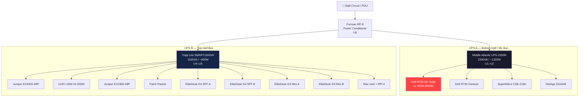

# ⚡ Power Distribution
**Tags:** #infrastructure #power #ups  
**Related:** [[Rack Layout]] · [[Compute/Dell R730 - ML Node]] · [[00 - Homelab MOC]]

---

## UPS Strategy — Split Bus Architecture

Two independent UPS units cover separate load zones, protecting different tiers of equipment based on criticality and power draw.

---

## UPS Specs

### Tripp Lite SMART1500VA (UPS B — Top Half)
| Field | Value |
|---|---|
| Model | SMART1500LCD |
| Capacity | 1500VA / 900W |
| Rack Position | U4–U5 (2U) |
| Form Factor | 2U rackmount |
| Runtime (half load) | ~15–20 min est. |
| Bus Assignment | Networking + Small compute |
| Output | 8 outlets (battery + surge) |

### Middle Atlantic UPS-2200R (UPS A — Bottom / ML Bus)
| Field | Value |
|---|---|
| Model | UPS-2200R |
| Capacity | 2200VA / 1320W |
| Rack Position | U1–U2 (2U) |
| Form Factor | 2U rackmount |
| Runtime (half load) | ~10–15 min est. |
| Bus Assignment | Heavy compute + Storage |
| Role | Rack bottom anchor + ML power bus |
| Notes | Arrived to anchor the bottom of the rack |

---

## Load Estimates

> [!NOTE]
> These are rough estimates. Actual draw varies with workload. Meter each PDU circuit to validate.

| Device | Est. Draw (W) | UPS |
|---|---|---|
| Juniper EX3400-48P | ~150W | B |
| UniFi USW-24-250W | ~60W | B |
| Juniper EX2300-48P | ~80W | B |
| HP EliteDesk G4 SFF ×2 | ~130W | B |
| HP EliteDesk G3 Mini ×2 | ~80W | B |
| Mac mini + RPi 4 | ~30W | B |
| **UPS B Total Est.** | **~530W** | — |
| Dell R730 ML Node (idle) | ~200W | A |
| Dell R730 ML Node (CUDA load) | ~500W+ | A |
| Dell R730 General (idle) | ~150W | A |
| SuperMicro CSE-219U (idle) | ~120W | A |
| NetApp DS4246 | ~60W | A |
| **UPS A Total Est. (idle)** | **~530W** | — |
| **UPS A Total Est. (ML load)** | **~830W+** | — |

> [!WARNING] CUDA Load
> QuarkyLab's RTX 6000 (soon RTX 8000 48GB) under full CUDA load can pull ~250W by itself. Once Jarvis gets its 2× RTX 6000 (~500W more, same UPS A bus), UPS A load climbs further — budget for both R730 GPUs plus dual Xeons each. Fernanda's ML workloads may push UPS A well above 1000W. Monitor via iDRAC and UPS display. UPS-2200R rated at 1320W continuous — watch it closely as the Jarvis GPUs come online.

---

## Furman RP-8

- **Role:** Power conditioning / noise filtering upstream of both UPS units
- **Position:** U6
- **Outlets:** 8 total (rear-mount)
- **Features:** Surge protection, EMI/RFI filtering, voltmeter

---

## 🔋 UPS Monitoring (Live — 2026-06-26)

NUT (Network UPS Tools 2.8.1) runs on the **pve3 host** as a network server (`MODE=netserver`),
exposing both UPS units on TCP 3493. Homepage (LXC 106) shows live `peanut` widgets for each in a
"Power & UPS" group (Middle Atlantic = UPS A, Tripp Lite = UPS B).

| UPS | NUT name | Driver | Connection |
|---|---|---|---|
| Tripp Lite SMART1500 | `tripplite` | `usbhid-ups` | USB → pve3 (`09ae:2012`) |
| Middle Atlantic UPS-OL2200R | `midatlantic` | `snmp-ups` (`mibs=cyberpower`) | SNMP card `192.168.10.180`, RFC1628 UPS-MIB, enterprise OID 3808 = CyberPower (Mid-Atlantic rebrands CyberPower OL) |

- **upsd** listens on `127.0.0.1:3493` + `192.168.10.201:3493` (anonymous read).
- **upsmon** monitors both locally (`monuser`, primary role) — logging only, no auto-shutdown wired yet.
- Config lives in `/etc/nut/{nut,ups,upsd,upsd.users,upsmon}.conf` on pve3. monuser password is **not** in git.
- Boot-enabled services: `nut-server`, `nut-monitor`, `nut-driver@tripplite`, `nut-driver@midatlantic`.
- **PeaNUT** (`brandawg93/peanut`, container in LXC 106 `docker-compose.yml`, port `8081→8080`) bridges
  `upsd` → the REST API that Homepage's `peanut` widget consumes (Basic Auth, user `homepage`; creds **not** in git).
  Homepage v1.13 has no direct `nut` widget — it integrates NUT only via PeaNUT. PeaNUT also serves its own UPS dashboard.
- Homepage `peanut` widgets show battery %, load %, and status. See [[Runbook/Homepage-Setup-2026-06-26]].

### Grafana dashboard + alerting (live — 2026-06-26)
- **Prometheus** (LXC 103) scrapes PeaNUT metrics — job `peanut-ups`, target `192.168.10.148:8081`, basic auth, 30s.
- **Grafana dashboard** `/d/netframe-ups` ("NetFRAME — UPS Power"): battery %, load, runtime, real-power gauges + time-series per UPS.
- **Alert rules** (folder "UPS Alerts"): `UPS battery low` (<50%) and `UPS runtime low` (<5 min), per UPS.
- **Notifications → Discord**, two independent paths:
  - Grafana contact point `discord-ups` (metric-based, ~30s) — default notification policy routes here.
  - NUT `upsmon` → `/etc/nut/notify-discord.sh` (instant, event-driven: ONBATT/LOWBATT/ONLINE/COMMBAD/COMMOK/REPLBATT/SHUTDOWN).
- Discord webhook URL is stored server-side only (Grafana DB + root-only `notify-discord.sh`, `chmod 700`) — **not** in git.
- Grafana admin password was reset this session (stored in Vaultwarden). Prometheus stays localhost-bound (F-03); the scrape is outbound Prometheus→PeaNUT.
