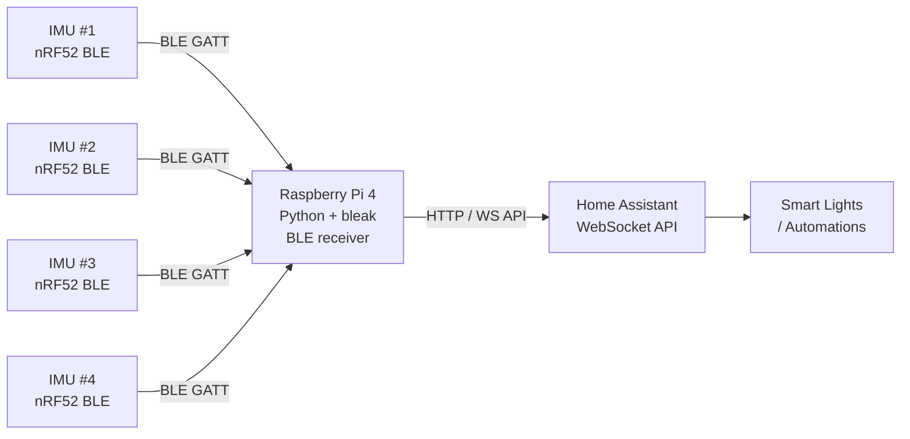

# 🎮 IMU Gesture Control — Nordic nRF52 → Home Assistant
**Tags:** #projects #iot #homeassistant #bluetooth #python  
**Related:** [[Infrastructure/Services & VMs]] · [[Compute/Small Node Cluster]]  
**Status:** ✅ Live — running on RPi 4 with systemd autostart

---

## Overview

Four Sword Health Alpha Motion Tracker IMUs (Nordic nRF52-based) repurposed as gesture controllers for Home Assistant lighting automation via Bluetooth BLE.

---

## Hardware

| Item | Detail |
|---|---|
| IMU | Sword Health Alpha Motion Tracker |
| MCU | Nordic Semiconductor nRF52 series |
| Protocol | BLE (Bluetooth Low Energy) |
| Host | Raspberry Pi 4 |
| Integration | Home Assistant via Python/bleak script |

---

## Architecture



---

## Software Stack

- **Language:** Python 3
- **BLE library:** `bleak` (async BLE client)
- **HA integration:** Home Assistant WebSocket API or REST API
- **Process management:** `systemd` service (autostart on boot)

---

## Script — Key Logic

```python
import asyncio
from bleak import BleakScanner, BleakClient
import aiohttp

IMU_ADDRESSES = [
    "AA:BB:CC:DD:EE:01",  # IMU #1
    "AA:BB:CC:DD:EE:02",  # IMU #2
    "AA:BB:CC:DD:EE:03",  # IMU #3
    "AA:BB:CC:DD:EE:04",  # IMU #4
]

HA_URL = "http://10.0.50.1:8123"
HA_TOKEN = "<long-lived-access-token>"

GESTURE_CHARACTERISTIC = "XXXX-..."  # nRF52 GATT characteristic UUID

async def handle_gesture(sender, data):
    gesture = parse_gesture(data)
    await send_to_ha(gesture)

async def parse_gesture(data):
    # Decode IMU packet → gesture type
    # e.g., shake → toggle lights, tilt left → dim, etc.
    ...

async def send_to_ha(gesture):
    headers = {"Authorization": f"Bearer {HA_TOKEN}"}
    payload = {"entity_id": "light.living_room"}
    async with aiohttp.ClientSession() as session:
        if gesture == "shake":
            await session.post(f"{HA_URL}/api/services/light/toggle",
                               json=payload, headers=headers)

async def main():
    for addr in IMU_ADDRESSES:
        client = BleakClient(addr)
        await client.connect()
        await client.start_notify(GESTURE_CHARACTERISTIC, handle_gesture)
    await asyncio.sleep(float("inf"))

asyncio.run(main())
```

---

## systemd Service

```ini
# /etc/systemd/system/imu-gesture.service
[Unit]
Description=IMU Gesture → Home Assistant Bridge
After=network.target bluetooth.target

[Service]
ExecStart=/usr/bin/python3 /home/machismo/imu-gesture/main.py
Restart=on-failure
User=machismo
WorkingDirectory=/home/machismo/imu-gesture

[Install]
WantedBy=multi-user.target
```

```bash
sudo systemctl enable imu-gesture
sudo systemctl start imu-gesture
sudo systemctl status imu-gesture
```

---

## Reverse Engineering Notes

- IMUs use standard nRF52 BLE GATT profile
- Accelerometer / gyro data exposed on custom GATT characteristics
- Scan with `bluetoothctl` or `bleak` scanner to enumerate services/characteristics
- Gesture detection: threshold-based on accelerometer magnitude deltas

```bash
# Scan for IMUs
python3 -c "
import asyncio
from bleak import BleakScanner
async def scan():
    devices = await BleakScanner.discover(timeout=5.0)
    for d in devices: print(d)
asyncio.run(scan())
"
```

---

## GitHub README (Planned)

- [ ] Document IMU hardware teardown
- [ ] Describe BLE characteristic mapping
- [ ] Publish Python script with config template
- [ ] Add wiring diagram for RPi BLE setup
