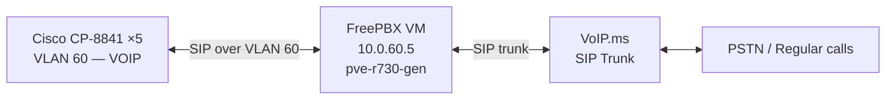

# ☎️ VoIP — FreePBX + Cisco CP-8841
**Tags:** #projects #voip #cisco #freepbx  
**Related:** [[Infrastructure/Services & VMs]] · [[Infrastructure/Proxmox Cluster]] · [[Networking/Network Overview]]  
**Status:** ⏸️ Deferred — pending core infrastructure stability

---

## Overview

Five Cisco CP-8841 SIP phones integrated with a FreePBX VM on Proxmox, using VoIP.ms as the SIP trunk provider.

---

## Hardware

| Item | Qty | Notes |
|---|---|---|
| Cisco CP-8841 | 5 | SIP-capable (not SCCP-locked) |
| PoE source | — | [[Networking/UniFi USW-24-250W]] or EX3400 |

> [!NOTE] Phone Firmware
> CP-8841 ships with SCCP firmware by default. Must convert to SIP firmware via TFTP provisioning before registering with FreePBX. See procedure below.

---

## Architecture



---

## VLAN Assignment

- VOIP VLAN: **60** (`10.0.60.0/24`)
- Phones connect to EX3400 or USW-24 ports in access mode on VLAN 60
- CDP/LLDP-MED used to provision phone VLAN automatically (optional)

---

## FreePBX VM Specs

| Field | Value |
|---|---|
| Host | pve-r730-gen |
| OS | FreePBX Distro (AlmaLinux-based) or Asterisk on Debian |
| vCPU | 2 |
| RAM | 4 GB |
| IP | 10.0.60.5 (static) |
| Web UI | http://10.0.60.5/admin |

---

## CP-8841 → SIP Firmware Conversion

```bash
# 1. Set up TFTP server (on Proxmox VM or RPi)
apt install tftpd-hpa

# 2. Download SIP firmware from Cisco (requires CCO account)
#    File: cmterm-8841.11-5-1-SR1-1.zip (example)
#    Extract to /var/lib/tftpboot/

# 3. Create SEP<MAC>.cnf.xml for each phone
#    This tells the phone to load SIP firmware

# 4. Point phones to TFTP server via DHCP option 150
#    In OPNsense: Services > DHCPv4 > Additional > TFTP Server IP

# 5. Phone reboots, pulls firmware, converts to SIP
```

---

## FreePBX Extension Config

```
# Example extension (in FreePBX UI)
Extension: 1001
Display Name: Kyle
Secret: <strong-password>
Device: Cisco CP-8841

# Repeat for each phone: 1001–1005
```

---

## VoIP.ms SIP Trunk

```
# In FreePBX: Connectivity > Trunks > Add SIP Trunk

Host: chicago2.voip.ms (or nearest POP)
Username: <voipms-account>
Password: <voipms-subaccount-password>
Codecs: ulaw, alaw, g722
```

---

## Firewall Rules (OPNsense)

```
# VOIP VLAN (60) rules:
Allow → VoIP.ms POP IPs (UDP 5060, UDP 10000-20000)
Allow → FreePBX VM (UDP/TCP 5060)
Block → all other inter-VLAN traffic from VOIP
```

---

## Runbook

See [[Runbook/Daily Operations]] — "VoIP troubleshooting" section.

---

## Dependencies Before Deploying

- [x] Phones acquired (5× CP-8841)
- [ ] Core infrastructure stable (Proxmox cluster, OPNsense)
- [ ] VLAN 60 provisioned and tested
- [ ] TFTP server running for firmware conversion
- [ ] VoIP.ms account configured
- [ ] FreePBX VM deployed
