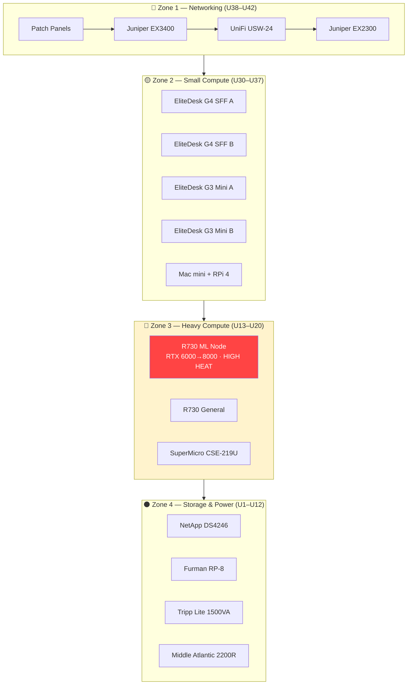

# 🗄️ Rack Layout
**Tags:** #infrastructure #rack #physical  
**Related:** [[00 - Homelab MOC]] · [[Power Distribution]] · [[Networking/Network Overview]]

---

## Cabinet Specs

| Field | Value |
|---|---|
| Model | NetFRAME CS9000 |
| Size | 42U |
| Internal Depth | 24" (usable) |
| Note | Rear panel **removed** — R730s extend ~28" |
| Location | Vermilion / Greater Cleveland, OH |

> [!WARNING] Depth Issue
> Dell R730s are ~28" deep, exceeding the CS9000's 24" internal depth. **Rear panel has been physically removed** to accommodate. Ensure rear clearance from wall for adequate airflow.

---

## 📐 Physical Rack Diagram (Top → Bottom)

```
┌─────────────────────────────────────────┐
│  U42  │ Leviton Patch Panel #1          │ ◄ CAT6 front-panel patching
│  U41  │ Leviton Patch Panel #2          │ ◄ CAT6 front-panel patching
├───────┼─────────────────────────────────┤
│  U40  │ Juniper EX3400-48P (PoE+)       │ ◄ Core switch, dual PSU, 10G uplinks
│  U39  │ UniFi USW-24-250W (PoE+)        │ ◄ Access/AP switch
│  U38  │ Juniper EX2300-48P              │ ◄ Secondary / lab switch
├───────┼─────────────────────────────────┤
│  U37  │ ─── Cable Management ───        │
│ U36–  │ HP EliteDesk G4 SFF ×2          │ ◄ i7-8700 │ 48GB / 32GB
│  U34  │   (3U shelf)                    │   Proxmox nodes
│ U33–  │ HP EliteDesk G3 Mini ×2         │ ◄ i5-7th │ 32GB each
│  U31  │   (3U shelf)                    │   Proxmox nodes
├───────┼─────────────────────────────────┤
│  U30  │ Mac mini (2011) + RPi 4 (1U)    │ ◄ Pi-hole / Home Assistant
├───────┼─────────────────────────────────┤
│ U29–  │ ─── Open / Cable Reserve ───    │
│  U21  │                                 │
├───────┼─────────────────────────────────┤
│ U20–  │ Dell R730 #1 — ML Node          │ ◄ 28c/56t │ 384GB │ RTX 6000→8000
│  U18  │   (2U — rear panel removed)     │   Fernanda's CUDA workloads
├───────┼─────────────────────────────────┤
│  U17  │ ─── Spacer ───                  │
├───────┼─────────────────────────────────┤
│ U16–  │ Dell R730 #2 — General          │ ◄ 24c/48t │ 64GB │ General compute
│  U15  │   (2U — rear panel removed)     │
├───────┼─────────────────────────────────┤
│ U14–  │ SuperMicro CSE-219U             │ ◄ 24c/48t │ 64GB
│  U13  │   (2U)                          │
├───────┼─────────────────────────────────┤
│ U12–  │ NetApp DS4246 (4U JBOD)         │ ◄ 24-bay │ 6× HGST 2TB SATA
│   U8  │                                 │
├───────┼─────────────────────────────────┤
│   U7  │ ─── Cable Management ───        │
│   U6  │ Furman RP-8 Power Conditioner   │ ◄ Power conditioning, 8-outlet
├───────┼─────────────────────────────────┤
│  U5–  │ Tripp Lite SMART1500VA (2U)     │ ◄ UPS A — feeds top half
│   U4  │                                 │
├───────┼─────────────────────────────────┤
│  U3   │ ─── Spacer ───                  │
│  U2–  │ Middle Atlantic UPS-2200R (2U)  │ ◄ UPS B — feeds bottom / ML bus
│   U1  │                                 │   Rack bottom anchor
└───────┴─────────────────────────────────┘
```

---

## 🌡️ Thermal Zones



> [!TIP] Airflow
> Standard rack front-to-back airflow. Ensure rear clearance is unobstructed (rear panel removed). R730s in Zone 3 generate significant heat — monitor inlet temps via iDRAC.

---

## 🔩 Physical Notes

- **R730 depth resolution:** Rear panel of CS9000 removed permanently. Both R730s slide in from front, with PSU handles protruding rear. Ensure adequate wall clearance (~6–8").
- **Shelf equipment:** EliteDesks and Mac mini use standard 1U/3U vented shelves. Secure with velcro + rack screws.
- **DS4246 weight:** ~45 lbs populated. Mount from bottom up — NetApp shelf seated before anything above it.
- **Cable mgmt:** Horizontal managers at U37 and U7. Vertical cable lacing strips on both rack sides.

---

## 📋 Bill of Materials (Physical)

| Item | Qty | Notes |
|---|---|---|
| NetFRAME CS9000 42U | 1 | Main cabinet |
| Dell R730 (2U) | 2 | Rear panel removed for depth |
| SuperMicro CSE-219U (2U) | 1 | Standard depth |
| NetApp DS4246 (4U) | 1 | 24-bay JBOD |
| HP EliteDesk G4 SFF | 2 | On 3U shelves |
| HP EliteDesk G3 Mini | 2 | On 3U shelves |
| Mac mini (2011) | 1 | 1U shelf w/ RPi |
| Raspberry Pi 4 | 1 | Co-mounted w/ Mac mini |
| Juniper EX3400-48P | 1 | 1U, dual PSU |
| UniFi USW-24-250W | 1 | 1U |
| Juniper EX2300-48P | 1 | 1U |
| Leviton Patch Panel | 2 | 1U each |
| Middle Atlantic UPS-2200R | 1 | 2U, bottom anchor |
| Tripp Lite SMART1500VA | 1 | 2U |
| Furman RP-8 | 1 | 1U power conditioner |
