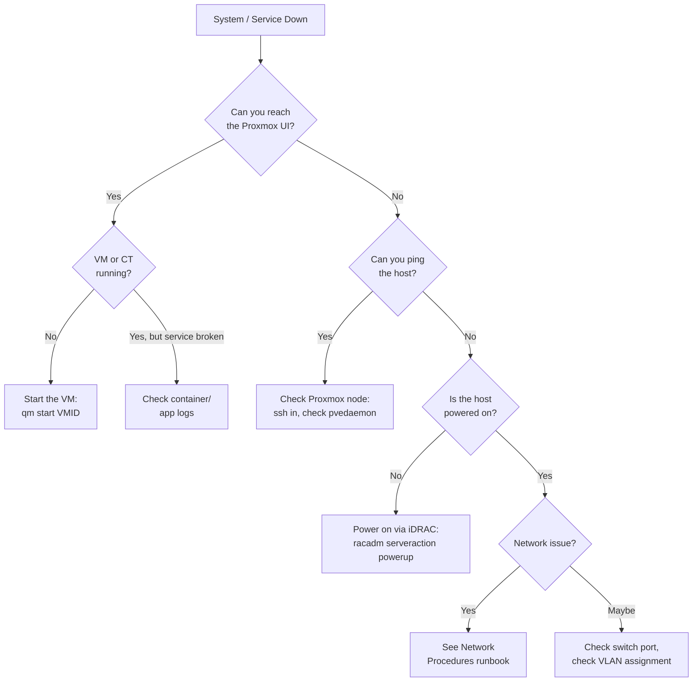

# 📋 Runbook — Recovery Procedures
**Tags:** #runbook #recovery #disaster-recovery  
**Related:** [[Runbook/Daily Operations]] · [[Infrastructure/Proxmox Cluster]] · [[Infrastructure/Storage]]

---

> [!DANGER] This runbook covers failure scenarios. Stay calm. Work methodically. Check the most likely causes first.

---

## 🔴 Decision Tree — System Down



---

## 🔁 VM / Service Recovery

### Restore VM from PBS Backup

```bash
# 1. Open Proxmox Backup Server UI
https://10.0.10.30:8007

# 2. Find backup (Datastore > Backups)

# 3. Restore via CLI
proxmox-backup-client restore \
  --repository 10.0.10.30:backups \
  vm/<vmid>/<snapshot>.fidx \
  /dev/vda

# 4. Or restore via Proxmox UI:
# Datacenter > Storage > PBS > Backups > Restore
```

### Rollback VM Snapshot

```bash
qm rollback <vmid> <snapname>
qm start <vmid>
```

### Emergency VM Start on Different Node

```bash
# If primary node is dead, restart VM on another node
# (requires shared storage — NFS from DS4246)
qm migrate <vmid> <target-node> --online 0
qm start <vmid>
```

---

## 💾 ZFS Recovery

### Pool Degraded (1 Drive Failure — RAIDZ1)

```bash
# Check status
zpool status datastore

# Output will show: DEGRADED, with faulted/removed drive

# 1. Identify replacement drive
lsblk

# 2. Replace failed drive (hot-swap in DS4246)
zpool replace datastore /dev/sdX /dev/sdY

# 3. Monitor resilver
zpool status -v datastore
# Resilver may take hours for large pools
```

### Pool Scrub (data verification)

```bash
zpool scrub datastore
watch -n 5 zpool status datastore
```

### Corrupted Dataset

```bash
# List datasets
zfs list

# Roll back to last snapshot
zfs rollback datastore/vms@<snapshot-name>

# List snapshots
zfs list -t snapshot
```

---

## 🔌 Power Failure Recovery

### After UPS Battery Exhaustion / Power Loss

```bash
# 1. Verify wall power restored
# 2. Check UPS panels — both UPS A and B should show "Online"
# 3. Follow startup sequence from [[Runbook/Daily Operations]]

# 4. Check ZFS pool integrity after unclean shutdown
zpool status datastore
# If FAULTED: may need zpool import -f datastore

# 5. Check all VMs came back up
pvecm status
qm list   # on each node

# 6. Manually start any VMs that didn't auto-start
qm start <vmid>
```

### NUT Auto-Shutdown Config

```bash
# /etc/nut/upsmon.conf
MONITOR tripplite@localhost 1 upsmaster <pass> master
MINSUPPLIES 1
SHUTDOWNCMD "/sbin/shutdown -h now"
POWERDOWNFLAG /etc/killpower
FINALDELAY 5
```

---

## 🌐 Network Recovery

### OPNsense VM Unreachable (No Internet / No Inter-VLAN)

```bash
# Access OPNsense console via Proxmox UI
# Proxmox > pve-r730-gen > OPNsense VM > Console

# In OPNsense console — option 8 (Shell)
pfctl -d    # temporarily disable firewall (emergency)
# Then fix the config

# Or restart OPNsense networking
/etc/rc.restart_webgui
```

### Switch Config Corruption / Rollback

```junos
# Connect via console (RJ45 serial)
# Rollback to last known good
rollback 1
show | compare
commit

# Rollback history
show system rollback
```

### Lost Management Access to EX3400

```bash
# Physical console: RJ45 → USB console cable
screen /dev/ttyUSB0 9600

# Recover from rescue config
# 1. Boot into rescue
# 2. Load backup config:
load override /tmp/ex3400-backup.conf
commit
```

---

## 🖥️ iDRAC / IPMI Recovery

### R730 Won't POST

```bash
# Force cold reset via racadm
racadm -r 10.0.10.10 -u root -p <pass> serveraction hardreset

# Virtual console (check POST output)
racadm -r 10.0.10.10 -u root -p <pass> getconfig -g cfgRacVirtual

# Check hardware alarms
racadm -r 10.0.10.10 -u root -p <pass> getsel

# If iDRAC itself is unresponsive
racadm -r 10.0.10.10 -u root -p <pass> racreset
# Wait 90 seconds for iDRAC to reboot
```

---

## 📞 Emergency Contacts / Resources

| Resource | Link |
|---|---|
| Proxmox Forums | https://forum.proxmox.com |
| Juniper KB | https://kb.juniper.net |
| Dell iDRAC Guide | https://dell.com/idrac |
| NetApp DS4246 Docs | https://docs.netapp.com |
| r/homelab | https://reddit.com/r/homelab |
| r/selfhosted | https://reddit.com/r/selfhosted |
| kylemason.org | https://kylemason.org |
