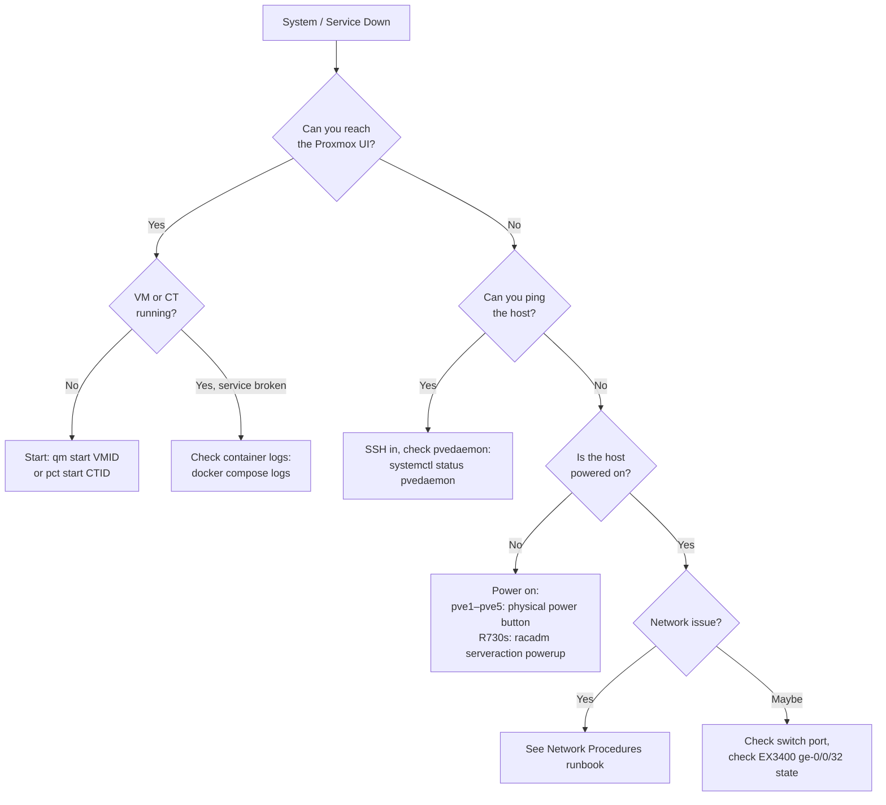

# 📋 Runbook — Recovery Procedures
**Tags:** #runbook #recovery #disaster-recovery
**Related:** [[Runbook/Daily Operations]] · [[Infrastructure/Proxmox Cluster]] · [[Infrastructure/Storage]]

---

> [!DANGER] Stay calm. Work methodically. Check the most likely causes first.
> Current flat subnet: 192.168.10.0/24. VLANs not yet active.

---

## 🔴 Decision Tree — System Down



---

## 🐳 Service Recovery (pve3)

### Docker container down

```bash
ssh root@192.168.10.201
# Enter the CT — pct enter 101 / 102 / 103

# NPM (CT 101)
cd /opt/nginx-proxy-manager && docker compose up -d

# Vaultwarden (CT 102)
cd /opt/vaultwarden && docker compose up -d

# Grafana stack (CT 103)
cd /opt/grafana && docker compose up -d
```

### Container won't start — permission denied on data dirs

```bash
cd /opt/grafana
chmod 777 grafana-data prometheus-data loki-data
docker compose up -d
```

### Vaultwarden — recreate after env change

```bash
cd /opt/vaultwarden
docker compose up -d --force-recreate
```

---

## 🖥️ Proxmox Node Recovery

### Node unreachable but pingable

```bash
ssh root@192.168.10.20X
systemctl status pvedaemon pveproxy
systemctl restart pvedaemon pveproxy
```

### OPNsense VM unreachable (VM 100 on pve2)

```bash
# Console access — does not need network
ssh root@192.168.10.204
qm terminal 100
# Press Enter, then select option from OPNsense menu

# If VM config read-only:
chmod 640 /etc/pve/nodes/pve2/qemu-server/100.conf

# Start if stopped:
qm start 100
```

### Proxmox cluster quorum lost

```bash
pvecm status   # check expected vs quorum votes
# If single surviving node:
pvecm expected 1
```

---

## 🔌 Power Failure Recovery

```
1. Verify wall power restored
2. Check UPS A (Tripp Lite) and UPS B (Middle Atlantic) panels — both show "Online"
3. Follow startup sequence from [[Runbook/Daily Operations]]
4. Check all containers on pve3 came back up (they should restart: unless-stopped)
5. Manually start any that didn't: docker compose up -d in each CT
```

---

## 💾 ZFS Recovery (future — once DS4246 is connected)

### Pool degraded (1 drive failure — RAIDZ1)

```bash
zpool status datastore
# Replace failed drive
zpool replace datastore /dev/sdX /dev/sdY
# Monitor resilver
watch -n 10 zpool status datastore
```

### Corrupted dataset

```bash
zfs list -t snapshot
zfs rollback datastore/vms@<snapshot-name>
```

### Unclean shutdown

```bash
zpool status datastore
# If FAULTED:
zpool import -f datastore
```

---

## 🌐 Network Recovery

### Can't reach EX3400 from Ares

```bash
# WiFi path is broken — must use wired
sudo ip addr add 192.168.10.100/24 dev enp0s31f6
sudo ip link set enp0s31f6 up
ping 192.168.10.50
ssh mason@192.168.10.50
```

### EX3400 config corruption / rollback

```junos
# Via console (RJ45 serial cable)
screen /dev/ttyUSB0 9600

rollback 1
show | compare
commit
```

### Lost management access to EX3400

```bash
# Physical console: RJ45 → USB adapter → Ares
screen /dev/ttyUSB0 9600

# Load backup config:
load override /tmp/ex3400-backup.conf
commit
```

---

## 🖥️ iDRAC Recovery (R730s)

### R730 won't POST

```bash
# Check iDRAC event log
racadm -r 192.168.10.21 -u root -p <pass> getsel

# Force cold reset
racadm -r 192.168.10.21 -u root -p <pass> serveraction hardreset

# Reset iDRAC itself (wait 90s after)
racadm -r 192.168.10.21 -u root -p <pass> racreset
```

> [!WARNING] R730 CPU Stepping
> Silent QPI hang (no error displayed) is caused by mismatched CPU S-spec steppings. If R730 hangs at POST with no error after firmware update, verify both CPU S-specs match. See `docs/r730-bios-recovery-runbook.md`.

### R730 BIOS recovery (quarkylab — iDRAC needs 2.86 first)

```bash
# Step 1: Update iDRAC/LC via TFTP (no Enterprise license required)
racadm -r 192.168.10.20 -u root -p <pass> fwupdate -g -u -a <tftp-server-ip> -d firmimg.d7

# Step 2: After iDRAC reboots, flash BIOS via web UI
# https://192.168.10.20 → Maintenance → System Update
```

---

## 📞 Resources

| Resource | Link |
|---|---|
| Proxmox Forums | https://forum.proxmox.com |
| Juniper KB | https://kb.juniper.net |
| Dell iDRAC Guide | https://dell.com/idrac |
| R730 BIOS Recovery Runbook | `Home-Lab/docs/r730-bios-recovery-runbook.md` |
| EX3400 SSH Incident RCA | `Home-Lab/runbooks/EX3400-SSH-Auth-Failure-RCA.md` |
| OPNsense Serial Console | `Home-Lab/docs/opnsense-serial-console-2026-06-15.md` |
| r/homelab | https://reddit.com/r/homelab |
| kylemason.org | https://kylemason.org |
